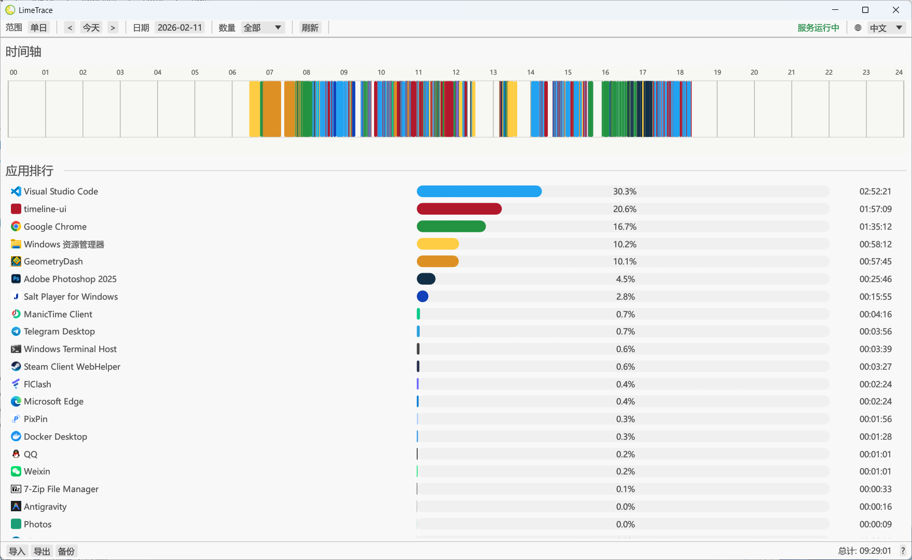

# LimeTrace (Windows Time Tracking)

中文版: [README.md](README.md)

LimeTrace is a lightweight Windows desktop time-tracking app written in Rust.
It records your active apps in the background and shows usage on a timeline.

Windows only.

## How to Install

1. Open this repository's `Releases` page.
2. Download `LimeTraceSetup.exe`.
3. Double-click to install.
4. After installation, backend tracking starts automatically and the UI opens.

## Notes

- UI executable is `limetrace.exe`.
- Backend executable is `limetrace-backend.exe`, added to startup. If the service is not running, open this program.
- Startup registry key: `HKCU\Software\Microsoft\Windows\CurrentVersion\Run\LimeTraceBackend`

## Data Location

- Default database: `%LOCALAPPDATA%\LimeTrace\tracker.db`

## How to Confirm It's Working

1. After installation, use your PC normally for a few minutes.
2. Open `LimeTrace -> Open LimeTrace` from the Start Menu.
3. If you can see timeline and app usage duration data, it's working correctly.

## Contact

- QQ: `1084490278`
- Email: `jethuit@outlook.com`
- If you run into any issues, please open an issue.
